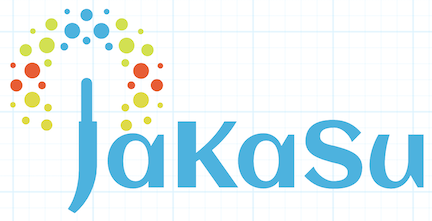

# JaKaSu - Java Kafka Subscriber



> **_Powerful config driven SDK to easily consume events from one or multiple Kafka topics in both standard and streaming modes._ It seamlessly converts an existing app into a Kafka Subscriber or builds a new one from scratch with low code.**

#### JaKaSu SDK supports two types of Kafka consumer:

- Standard Consumer SDK : suitable for an application which subscribes to an event in Kafka and wants to read and process the data only

- KStreams Consumer SDK : suitable for an application which subscribes to an event in Kafka and wants to read, process and write back the processed data to another Kafka topic

If you are consuming from multiple topics, you can use a combination of Consumer/KStreams to fit the needs of each topic.

## Features:
- Removes the overhead of setting up a Kafka consumer and connecting to a cluster
- Develop with Kafka regardless of experience level
- Consume from multiple Kafka topics in parallel and process them independently
- Optional configuration for flexible development
- Can use Kafka with SSL or non SSL
- Convert an existing app into a Kafka Subscriber or build a new one from scratch while writing very little code.
- Sample app provided can just be copied to run a Kafka Subscriber out of the box
- Provides a replay / recover mechanism to get the same message from a Kafka topic at the same offset if the message processing fails

## Prerequisite
- Java
- Spring Framework
- Kafka

## Getting Started
- If using SSL, consumers need to procure the Kafka topics' SSL certificates and add them to the configuration file. They would also need to procure their own certificate and add it to the JKS file. 

- Create a maven project and add the Jakasu SDK dependency to your project (check out the latest version)
```yaml

  <dependency> 
      <groupId>com.americanexpress.jakasu</groupId>
      <artifactId>jakasu-subscriber-core</artifactId>
      <version>1.0.0</version> // checkout latest released version
  </dependency>
```

- Create a Subscriber by implementing the Subscriber interface. The Subscriber interface consists of 3 methods:

  * subscribe(String payload, Map headers) : This is the main method which is triggered when a event/message is received on the subscribed kafka topic (configured in property file)

  * handleError(SubscriberException ex) : This method will be invoked by framework automatically when the subscribe method throws a SubscriberException. You can log / handle this error, and the offset is automatically acknowledged so that you are not stuck and can keep processing next message

  * recoveryHandler(String payload, Map headers) : This is an alternate path of processing which is triggered. After all the configured retries have expired and if this method is successful - it automatically acknowledges offset so that it can go on processing with other messages using the normal flow. If this method is also unsuccessful, then the Kafka listener will shutdown

```java
public class TestSubscriber implements Subscriber { 
    private static final Logger LOGGER = LoggerFactory.getLogger(TestSubscriber.class); 
            
    @Override 
    public boolean recoveryHandler(String payLoad, Map<String, String> headers) { 
        //alternate path 
        return true; 
    } 
            
    @Override public void handleError(SubscriberException ex) { } 
            
    @Override public boolean subscribe(String payLoad, Map<String,String> headers) {
        LOGGER.info(payLoad); 
        //Your processing here
        return true; 
    }

                       }
```

Add the annotation `@EnableJakasuConsumer` to add the Consumer SDK to your project in the SpringBoot Application main class

```java
    @SpringBootApplication
    @EnableJakasuConsumer
    public class JakasuSubscriberApp {
        public static void main(String[] args) {
            new SpringApplicationBuilder()
                .environment(new StandardEncryptableEnvironment())
                .sources(JakasuSubscriberApp.class).run(args);
        }
    }

```
    
### Configuring the Application

All Kafka related generic properties like broker, topic, and groupid can be configured as follows:

**Minimum configuration needed** (example):

```yaml
jakasu:
  subs:
    example1:
      classname: com.americanexpress.jakasu.subscriber.examples.subscriber.TestSubscriber
      topic:
        name: "Input-Topic"
      groupid: "Consumer-Group"
      bootstrap-servers: yourhost:port
```

**Multiple topics and custom configuration** (example):
    
```yaml
jakasu:
  subs:
    example1:
      classname: com.americanexpress.jakasu.examples.subscriber.TestSubscriber
      topic:
        name: "Input-Topic"
      groupid: "Consumer-Group"
      bootstrap-servers: yourhost:port
      
    ex2: #this label can be changed to give a more descriptive name to each 
      classname: com.americanexpress.jakasu.examples.subscriber.ExampleSubscriber #can be the same class or different
      groupid: "Consumer-Group-2"
      bootstrap-servers: yourhost:port
      topic:
        name: "Input-Topic-2" #can be the same topic or different
        # OPTIONAL CONFIG:
          session-timeout: 30000
          request-timeout: 40000
          max-poll-records: 300
          retry: 3
          backoff-period: 50
          reset-config: "earliest"
        filter:
          keys: source-type,event-type
          values: (Source1,Event1),(Source2,Event2)
    
    ex3: 
      classname: com.americanexpress.jakasu.examples.subscriber.OtherSubscriber
        groupid: "Consumer-Group-3"
        bootstrap-servers: yourhost:port
        topic:
          name: "Input-Topic-3"
        filter:
          custom-classname: com.americanexpress.jakasu.examples.subscriber.CustomFilter
          
```

**Required config values:**
    
- _classname:_ name of the class which implements the Subscriber interface in your project. If you are subscribing to multiple topics, use multiple subscriber classes if messages should be processed differently for each topic. Otherwise, you can choose the same subscriber class for your topics, and a unique instance will be created for each.
- _topic: name:_ name of the kafka topic to consume from
- _groupid:_ a consumer groupid which is unique to your application. 
- _bootstrap-servers:_ location for connecting to the kafka cluster. 

**Optional config values:**
- _topic: session-timeout:_ if the broker doesn't hear from the consumer in this amount of ms, it considers the consumer dead and rebalances the cluster.
    - default: 10000 
- _topic: request-timeout:_ amount of ms the consumer will wait for a response to a request before retrying. 
    - default: 30000 
- _topic: max-poll-records:_ max number of records returned in each poll
    - default: 500 
- _topic: retry:_ number of times to retry a request if there is no response
    - default: 2147483647
- _topic: backoff-period:_ amount of ms to wait before attempting to retry a failed request
    - default: 100 
- _topic: reset-config:_ which offset should a new consumer start from. "latest" means the consumer reads record from the queue which arrive after its creation. "earliest" means the consumer will read all records which already exist in the queue before its creation. If you do not have publishing permission for your topic, you can test your project by setting reset-config to "earliest" and renaming your consumer group for each test run to reconsume existing messages. If you are able to publish to your topic, consider using the <a href="https://github.com/americanexpress/jakapu">JaKaPu SDK</a> for easy publishing.
    - default: latest
- _filter:_ keys and values for which messages to extract from the input stream. Keys should be listed as comma separated strings and values should be listed as comma separated tuples.
    - _keys:_ provide as many keys for filtering as needed, with each key separated by a comma.
    - _values:_ provide the value to each of the specified keys above. 
    - default: none, processes all messages
    Alternatively, specify your own filter strategy by implementing the Filter interface and providing the name of the implementing class.
        
### Setup for the KStreams SDK

1. Add the annotation `@EnableJakasuStreams` to add the KStreams SDK to your project in the SpringBoot Application main class.

    ```java
        @EnableJakasuStreams
        public class JakasuStreamsApp {
        	public static void main(String[] args) {
        		new SpringApplicationBuilder()
        			.environment(new StandardEncryptableEnvironment())
        			.sources(JakasuStreamsApp.class).run(args);
        	}
        }
    ```

2. Create one or more processors to include all your business logic and extend the `StreamProcessor` class.
    ```java
        @Component
        public class ProcessorImpl extends StreamProcessor {
            private static final Logger LOGGER = LoggerFactory.getLogger(ProcessorImpl.class);
        
            @Override
            public String process(String payLoad, Map<String,String> headers) {
                LOGGER.info("Streams processor received {}", payLoad);
                return "mod by streams test" + payLoad;
            }
            
            @Override
            public String handleError(Exception ex, String payLoad, Map<String,String> headers) {
                LOGGER.error("Error processing message {}", payLoad);
                return null;
            }
        
        } 
    ```
    
    
- **process**(String payload, Map<String,String> headers) how to process a message
    - Return the transformed payload
- **handleError**(Exception ex, String payLoad, Map<String,String> headers) is triggered when an exception occurs while processing 
    - Return null or the result of a payload from an alternate processing path.
- **Optional: transformHeaders(Headers header)** if you want to modify the headers
    - No return value. Just modify the Header object 

#### Streams Configuration
   
Set the configuration in your `application.yml` files to consume from one or more topics. You should have one for each environment.


   **Minimum configuration needed** (example):

   ```yaml
   jakasu:
     subs:
       example1:   
         topic:
           name: "Input-Topic"
         groupid: "Consumer-Group"
         bootstrap-servers: yourhost:port
         streams:
           enable: true
           processor: com.americanexpress.jakasu.streams.examples.ProcessorImpl
           output-topic-name: "Output-Topic"
   ```

   **Multiple topics and custom config** (example):

   ```yaml
   jakasu:
        subs:
          example1:   
            topic:
              name: "Input-Topic"
            groupid: "Consumer-Group"
            bootstrap-servers: yourhost:port
            streams:
              enable: true
              processor: com.americanexpress.jakasu.streams.examples.ProcessorImpl
              output-topic-name: "Output-Topic"
          ex2:   
            topic:
              name: "Input-Topic-2" #can be the same topic or different
              session-timeout: 30000
              request-timeout: 30000
              retry: 3  
              backoff-period: 50  
              max-poll-records: 200
              reset-config: "earliest"                   
            groupid: "Consumer-Group-2"
            bootstrap-servers: yourhost:port
            streams:
              enable: true
              processor: com.americanexpress.jakasu.streams.examples.ProcessorImpl #can be the same class or different
              output-topic-name: "Output-Topic-2" #can be the same topic or different                     
              # OPTIONAL config:
              thread-count: 1
              poll-ms: 150
              process-guarantee: exactly_once
              topology-optimize: all
              buffer-records-per-partition: 500
              max-bytes-buffered: 1000000 
              dedup:
                enable: true
                id-header: "source-uniqueid"
                window-size: 7
                replication: 1 
              flatmap:
                enable: true
                id-header: "source-uniqueid"        
            filter:
              keys: source-type,event-type
              values: (Source1,Event1),(Source2,Event2)
          ex3:   
            topic:
              name: "Input-Topic-3"
            groupid: "Consumer-Group-3"
            bootstrap-servers: yourhost:port
            streams:
              enable: true
              processor: com.americanexpress.jakasu.streams.examples.ProcessorImpl
              output-topic-name: "Output-Topic-3"
              dedup:
                enable: true
                id-header: "source-uniqueid"
            filter:
              custom-classname: com.americanexpress.jakasu.examples.subscriber.CustomFilter
                          
   ```
    
 **Required config values:**
   
   -   _topic: name:_  name of the Kafka topic to consume from
   -   _groupid:_ a consumer group id unique to your application. 
   -   _bootstrap-servers:_  location for connecting to the Kafka cluster. 
   -   _streams: processor:_ name of the class extends StreamProcessor in your project. You can chain multiple processors together by listing them comma separated in the order in which they should execute. If you are subscribing to multiple topics, use a different processor class for each if messages should be processed differently for each topic. Otherwise, you can choose the same processor class for your topics, and a unique instance will be created for each.
   -   _streams: enable:_ must be set as "true" to use KStreams
   -   _streams: output-topic-name:_ the Kafka topic where the processed message should be published to. **You must be authorized as a publisher for this topic.**
       
   
 **Optional config values:**
   
   -   _thread-count_: The number of threads per topic to execute stream processing.
       -   default: 1
   -   _poll-ms_: The amount of time in milliseconds to block waiting for input while polling for records.
       -   default: 100
   -   _process-guarantee_:  "at_least_once" or "exactly_once". Set to "exactly_once" to guarantee that each record is processed once and only once, even if some failures are encountered in the middle of processing.
       -   default: "at_least_once"
   -   _topology-optimize_: "all" or "none". "all" reduces the footprint Kafka Streams creates especially with repartition.
       -   default: "none"
   -   _buffer-records-per-partition_:  The maximum number of records to buffer per partition.
       -   default: 1000
   -   _max-bytes-buffered_: Maximum number of memory bytes to be used for record caches across all threads.
       -   default: 10485760
   -   _topic: session-timeout:_ if the broker doesn't hear from the consumer in this amount of ms, it considers the consumer dead and rebalances the cluster.
       - default: 10000 
   -   _topic: request-timeout:_ amount of ms the consumer will wait for a response to a request before retrying. 
       - default: 30000 
   -   _topic: retry:_  Number of times to retry a request if there is no response
       -   default: 2147483647
   -   _topic: backoff-period:_  Amount of ms to wait before attempting to retry a failed request
       -   default: 100
   -   _topic: max-poll-records:_ max number of records returned in each poll
       - default: 500 
   -   _topic: reset-config:_ which offset should a new consumer start from. "latest" means the consumer reads record from the queue which arrive after its creation. "earliest" means the consumer will read all records which already exist in the queue before its creation. If you do not have publishing permission for your topic, you can test your project by setting reset-config to "earliest" and renaming your consumer group for each test run to reconsume existing messages. If you are able to publish to your topic, consider using the <a href="https://github.com/americanexpress/jakapu">JaKaPu SDK</a> for easy publishing.
       - default: latest
   -   _dedup: enable:_ Set to true if messages which are duplicates of another message which has already been processed should be skipped. **Note:** An internal topic will be created as a changelog of seen messages. You must be authorized to create topics in your Kafka cluster or have your administrator create the internal topic beforehand.
       -   default: false
   -   _dedup: id-header:_ The name of the message header which can be used as a unique identifier of message for deduplication. 
       -   default: No default value, but if not provided, a deduplication processor will not be added to the streams topology
   -   _dedup: window-size:_ Optionally specify the number of days to retain a message to check for duplicates.
       - default: 7 days. That is the default retention window for messages in a Kafka topic
   -   _dedup: replication:_ The replication factor of internal topics that Kafka Streams creates if using deduplication. This is the number of broker failures which can be tolerated.
       - default: 3     
   -   _flatmap: enable:_ Set to true if messages are in a bulk format with multiple events per message and should be split into messages with an individual in each when sent to output topic
       -   default: false
   -   _flatmap: id-header:_ The name of the message header which can be used as a unique identifier of message. Each event will be published with this event id, appended with the index of the event in the bulk message  
       -   default: No default value, but if not provided, a flatmap processor will not be added to the streams topology
   -   _filter:_  Keys and values for which messages to extract from the input stream. Keys should be listed as comma separated strings and values should be listed as comma separated tuples.
       -   _keys:_  Provide as many keys for filtering as needed, with each key separated by a comma.
       -   _values_:  Provide the value to each of the specified keys above. 
       -   default: none, processes all messages  
    
### Security Configuration   
All security related properties can be configured as follows:

```yaml
jakasu:  
  security:
    enabled: true
    protocol: SSL
    ssl:
      protocol: TLSv1.2
      keystore:
        type: JKS
        location: jakasu-subscriber-examples/src/main/cert/appkeystore.jks
        password: ENC(encryptedpasswordhere)
      truststore:
        location: jakasu-subscriber-examples/src/main/cert/kafka-client-yourtruststore.jks
        password: ENC(encryptedpasswordhere)

```
    
You will need to obtain certificates for your Kafka topic and be authorized as a consumer. Provide the path and password for these certificates here. 

**It is highly recommended to <a href="http://www.jasypt.org/"> encrypt your secrets</a>**

  ##### Refer to the example applications for how to use this and implement a Subscriber for your usecase.
  

## Contributing

We welcome Your interest in the American Express Open Source Community on Github. Any Contributor to
any Open Source Project managed by the American Express Open Source Community must accept and sign
an Agreement indicating agreement to the terms below. Except for the rights granted in this 
Agreement to American Express and to recipients of software distributed by American Express, You
reserve all right, title, and interest, if any, in and to Your Contributions. Please
[fill out the Agreement](https://cla-assistant.io/americanexpress/jakasu).

## License

Any contributions made under this project will be governed by the
[Apache License 2.0](./LICENSE.txt).

## Code of Conduct

This project adheres to the [American Express Community Guidelines](./CODE_OF_CONDUCT.md).
By participating, you are expected to honor these guidelines.